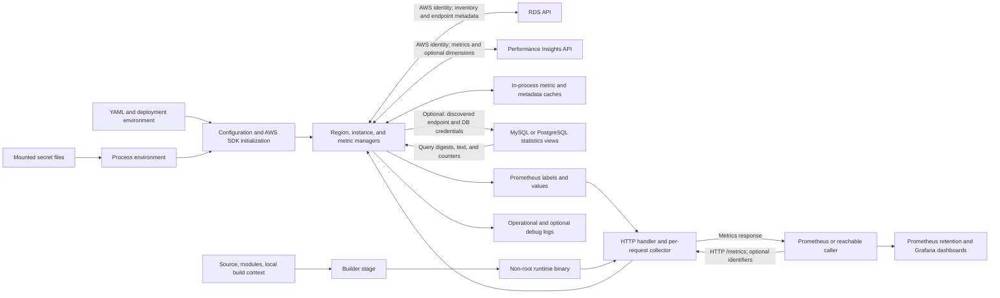

# Database Insights exporter threat model

## Scope and confidence

This assessment covers commit `ca5c62e`, reviewed on 2026-09-11: the Go HTTP entry point, discovery and metric managers, AWS/SQL clients, configuration and mounted-secret loading, caches, filtering, formatting, tests, dashboards, Dockerfile, dependency manifests, and documentation. It models the actual multi-region implementation, including optional SQL-dimension and direct database query-statistics collection, rather than only the simpler PI-exporter description in `README.md`.

No live AWS, database, HTTP endpoint, or production secret mount was accessed; no real credentials were decoded or tested. No network access or dependency download was permitted. Deployment manifests, IAM policies, network controls, actual configuration, Prometheus/Grafana authorization, and CI enforcement are absent from this checkout and remain unverified. Findings about code behavior are distinguished below from deployment-dependent impact. SQL collection performs fixed statistics queries; the exporter does not implement database writes or a general-purpose user-supplied SQL endpoint.

## System and assets

| Component | Security-relevant behavior and evidence |
| --- | --- |
| HTTP exporter | `cmd/main.go` registers `/metrics`, creates a fresh Prometheus registry/collector for each request, and uses `http.ListenAndServe(":<port>", nil)`. Default port is 8081. There is no local TLS, authentication, per-caller authorization, explicit server timeout, or global request admission control. |
| Target selection | `metricsHandler` accepts comma-separated `identifiers`, trims whitespace, and rejects more than five entries. Missing/empty selection collects all discovered instances. `SingleRegionManager.CollectMetricsForInstances` intersects identifiers with the already configured discovery set; it does not accept arbitrary endpoints or bypass instance filters. |
| Discovery | `pkg/manager/region/factory.go` creates managers for every configured region. `pkg/clients/rds/rds_client.go` uses the AWS SDK default configuration chain and paginates `DescribeDBInstances`. The instance manager selects supported, PI-enabled instances, applies filters, sorts oldest first, and limits the selected set. |
| PI metrics | `pkg/manager/metric/metric_manager.go` discovers metric metadata, applies metric filters, batches requests, and uses per-region metric-data caches. `pkg/clients/pi/pi_client.go` calls `ListAvailableResourceMetrics` and `GetResourceMetrics`; optional dimensions request top SQL or wait-event groups. |
| Direct database metrics | `pkg/clients/sql/` routes supported engines to fixed reads from MySQL `performance_schema.events_statements_summary_by_digest` or PostgreSQL `pg_stat_statements`. Endpoints/ports come from RDS discovery. Credentials are configured per cluster or through an all-cluster fallback. |
| Secrets and configuration | `internal/mountedsecrets/mountedsecrets.go` imports files under `/opt/secrets` into environment variables before config/SDK initialization. `pkg/utils/config_utils.go` reads YAML and resolves database passwords from environment-variable names; missing configuration produces defaults. |
| Output and consumers | `pkg/processing/formatting/response_formatter.go` emits identifiers, cluster, region, engine, and metric values. Optional query/SQL-dimension metrics include digest and statement labels. Both `dashboards/` JSON files display statement-based query tables through Prometheus. |
| Build/runtime | `Dockerfile` builds a binary using Go 1.25 Alpine, copies only that binary into an Alpine 3.22 runtime with CA certificates, and runs as `nobody`. `go.mod`/`go.sum` identify dependencies. No checked-in deployment, IAM policy, CI workflow, or `.dockerignore` is present. |

Assets include AWS credentials and their effective RDS/PI scope; database passwords and statistics-view privileges; database/cluster inventory; SQL structure and any sensitive text that survives source normalization; metric correctness and freshness; database/API/exporter availability; Prometheus storage/cardinality budgets; configuration and artifact integrity; and logs containing operational metadata. No actual SQL statements or production metric payloads were retrieved.

Actors include trusted scrapers/operators, other clients able to reach port 8081, a compromised scraper, an application user able to influence database query patterns, a principal able to modify RDS tags used for selection, maintainers/build operators, and actors able to alter configuration or mounted secrets. Network attackers matter for transport threats only if positioned on an applicable path. Neither public Internet reachability nor broad IAM/database permissions is proven here.

## Data flows and trust boundaries

The key boundary converts privileged cloud/database read access into data available to HTTP clients. Other boundaries are configuration/secret-provider authority to process-wide identity and destinations; workload-generated SQL to metrics labels; simultaneous scrapes to shared manager state; and exporter observations to downstream alert decisions. Prometheus/Grafana storage, access, and retention controls are external. The diagram does not establish any deployed ingress, service mesh, or network isolation.

## Existing controls and qualifications

- The five-identifier limit and intersection with configured instances constrain targeted scrapes. Instance filters have exclude precedence, AND across included fields, and OR among a field's patterns (`pkg/filter/pattern_filter.go`). They are collection policy, not per-client access control.
- Actual parsed limits are 1–25 selected instances per region and 1–4 workers per regional collection invocation (`parseInstancesConfig`, `parseProcessingConfig`). The declared `MaximumConcurrency = 60` is not used by that parser. Metadata and discovery TTLs are bounded; metric-data cache size is configured and enforced by the cache, though its configuration has no finite upper bound.
- Metric requests are batched at 15 names. `SingleRegionManager` uses a bounded worker queue. The metric-data cache and canonical-description registry use mutexes. This does not protect every other cached field or cap work across concurrent HTTP requests.
- Dimensions are disabled unless explicitly enabled with supported groups, and top-N is bounded to 25. Direct query metrics require enablement and usable credentials, with top-N bounded to 50 per ordering query. Both statistics clients use hardcoded ordering columns and integer limits; no HTTP-controlled SQL text reaches these queries.
- Database clients allow one connection per newly created pool and close it after each collection. MySQL sets connection/read timeouts; PostgreSQL sets a connection timeout and requests `sslmode=require`. Neither is an end-to-end global scrape deadline.
- The mounted-secret loader preserves existing environment values, including empty ones; prefers dynamic files over static files; avoids falling back to a stale static value when a dynamic key is unreadable; and does not log secret contents. Tests cover these properties. It intentionally follows projected-volume symlinks and loads only the documented directory depth.
- The final container is non-root and copies only the compiled binary from the builder. `go.sum` provides module checksum evidence. `Makefile` includes build/vet/coverage targets, and substantial unit/property tests exist. These do not establish that CI or Docker image publication runs them.
- Documentation is not fully aligned with code: README statements about single-region use and examples with more than 25 instances or four workers do not match the factory/parser. Its quick-start lacks the direct SQL and secret-loading details present in source.

## Prioritized threats

**P1** identifies high-impact confidentiality or authority boundaries to resolve before broader deployment. **P2** identifies availability, monitoring-integrity, or privileged-input risks. Likelihood is qualitative and conditional on deployment and optional features; no live exploitability was tested.

### DBI-01 — Reachable clients receive privileged inventory and optional SQL text

**P1 · Information disclosure / authorization failure · Likelihood: high if untrusted clients can reach the listener; optional SQL exposure requires enablement.**

`cmd/main.go` binds all interfaces with plain HTTP and no authentication. Omitting `identifiers` selects all configured/discovered instances. A caller can therefore obtain the exporter principal's allowed metric view without demonstrating independent entitlement. Filters still constrain collection, and identifiers cannot directly select a URL or bypass those filters; neither fact isolates one caller from another.

`ConvertDimensionToPrometheusMetric` and `ConvertQueryStatsToPrometheusMetrics` export statement text, truncated to 200 bytes plus an ellipsis where applicable, as a label. The SQL clients select up to 200 characters of source text, and dashboards display it. Normalized/tokenized source text and truncation are not confidentiality guarantees: schema/business structure and potentially sensitive fragments can remain. The metric include/exclude filter is applied to ordinary metadata metrics, not as a universal redaction policy over the separate dimension/query collection paths.

**Impact:** unauthorized topology/performance disclosure and, when enabled, SQL-text disclosure into HTTP responses, Prometheus retention, and dashboard access scopes. An on-path observer can read unprotected scrape traffic. Actual downstream retention and readers are unknown.

**Controls:** configured instance selection, SQL-statement truncation, optional-feature gates, and any external ingress policy, which is not in this repository.

**Mitigation:** restrict ingress to intended authenticated scrapers and protect transport, including direct service access; use separate exporters/identities for different visibility domains; disable statement labels by default or export only stable digests; define redaction and downstream retention/access policy. Do not use the query parameter as a security boundary.

**Residual risk / validation:** authorized scrapers can retain everything received. Verify deployed ingress and Prometheus/Grafana access, and inspect synthetic statement samples for sensitive content before enabling either optional SQL-text path.

### DBI-02 — Database transport and hand-built connection strings weaken credential protection

**P1 · Credential disclosure / endpoint impersonation · Likelihood: conditional on direct query metrics and network-path control.**

`pkg/clients/sql/mysql.go` constructs a DSN with timeout/read-timeout settings but no TLS option or verification policy. `pkg/clients/sql/postgres.go` requests `sslmode=require` but does not explicitly select hostname-verifying mode or configure trusted roots. The latter expresses an encryption requirement, not an explicit application-level server-identity validation policy. Actual negotiated settings, server enforcement, and driver/environment interactions were not tested.

Both clients interpolate usernames/passwords directly into DSN strings. In particular, PostgreSQL uses a URL without escaping user information, so reserved characters in legitimate rotated credentials can change parsing or cause failures. This is a connection-configuration issue, not demonstrated SQL injection or an HTTP-controlled destination override.

**Impact:** disclosure or interception of query-statistics traffic and potential credential misuse if the transport permits it; monitoring loss after credential rotation; possible unintended connection interpretation when configuration contains reserved characters. The code only issues statistics reads, but stolen-credential impact depends on actual database grants.

**Controls:** PostgreSQL encryption request, limited per-call pools, bounded MySQL timeouts, and discovered rather than user-supplied database endpoints.

**Mitigation:** require verified TLS for both engines using the intended CA/hostname policy; construct connection settings with driver configuration APIs or correctly encoded URL structures; grant narrowly scoped statistics-reader permissions; and restrict database egress. Sanitize driver errors before logs if they can contain connection material.

**Residual risk / validation:** a compromised database or exporter still sees authorized plaintext data. Test wrong-host/untrusted certificates, server TLS enforcement, and synthetic passwords with URL/DSN-reserved characters in an isolated harness. No actual password or connection was tested here.

### DBI-03 — Concurrent scrapes amplify cloud and database work beyond local limits

**P2 · Denial of service / cost amplification · Likelihood: medium when callers can issue repeated or overlapping scrapes.**

Every request gets a new collector and registry, while no process-wide scrape semaphore or rate limiter exists. The regional worker cap applies separately to each collection invocation. Both collector implementations use `context.Background()` rather than request cancellation or a bounded scrape context. `ListenAndServe` has no explicitly configured header/read/write/idle timeouts, and `promhttp.HandlerOpts{}` sets no explicit request limit or timeout.

Cache misses can trigger discovery and PI work, including application retries in `pkg/utils/retry.go`. Full scrapes also collect uncached dimensions and direct SQL statistics when enabled; each database call opens its own pool and performs two ranking queries. PostgreSQL configures connection timeout but not a query deadline here. HTTP disconnect or a Prometheus scrape timeout does not by itself cancel these background contexts. A five-identifier cap does not bound the all-instance path or total simultaneous work.

**Impact:** exporter exhaustion, throttled AWS APIs, costly repeated reads, database connection pressure, and delayed monitoring for legitimate scrapers.

**Controls:** per-invocation worker/queue limits, selected-instance caps, normal metric caches, retry counts, top-N bounds, and per-call database pool limits.

**Mitigation:** add global bounded admission and per-principal budgets; coalesce concurrent cache refreshes; collect on a controlled schedule where suitable; enforce overall collection and per-query deadlines; and propagate cancellation through the collection design. Configure HTTP timeouts, bound configured regions/cache size, and separate a cheap liveness endpoint from expensive scrapes.

**Residual risk / validation:** legitimate cold starts and synchronized scrapers can create bursts. Load-test concurrent full scrapes, stalled database reads, expired caches, slow HTTP clients, and request cancellation without touching production.

### DBI-04 — Concurrent requests race on discovery and metric-metadata state

**P2 · Monitoring integrity / availability · Likelihood: medium during concurrent first scrapes or TTL refreshes; race-detector confirmation pending.**

`RDSInstanceManager.GetInstances` reads and updates `Instances` and `InstancesLastUpdated` without synchronization. `MetricManager.getMetrics` reads/writes the shared `models.Metrics` metadata map/list/timestamp without a mutex or immutable snapshot publication. The managers are reused across concurrent HTTP requests, and copied instances still share their `Metrics` pointer. The mutex-protected metric-data cache does not protect these separate fields.

**Impact:** redundant refresh work and inconsistent metadata observations, potentially dropped metrics or runtime races. This review identifies conflicting accesses in source but does not claim a reproduced crash or remote code execution. Checks requiring the missing AWS/Prometheus dependencies could not run offline.

**Controls:** locks in the metric-data cache and description registry, plus bounded workers inside each collection. There is no equivalent lock/coalescing around the cited discovery/metadata refreshes.

**Mitigation:** use explicit synchronization and single-flight refresh by region/resource; publish immutable, internally consistent snapshots; avoid returning mutable shared metadata for concurrent mutation; and test simultaneous expiry and reads under the Go race detector.

**Residual risk / validation:** locking alone may serialize slow API operations and hurt latency. Validate both consistency and bounded refresh contention with mocked delayed APIs and overlapping scrape requests.

### DBI-05 — Successful HTTP scrapes conceal failed or incomplete collection

**P2 · Monitoring integrity / detection evasion · Likelihood: high when downstream errors occur; partial output is an intentional current behavior.**

`Collector.Collect` and `FilteredCollector.Collect` only log region-manager errors. `cmd/main_test.go` explicitly expects HTTP 200 for those errors in both all-instance and filtered paths. There is no exporter-success/error metric conveying these failures. `MultiRegionManager` stops at the first region error, which can also omit other regions, while already emitted data may remain in the response.

The SQL clients log query/scan failures and continue, eventually returning results with nil error even when both ranking queries fail; they do not check `rows.Err()` after iteration. The filtered region path returns after ordinary metric batches and does not collect the optional dimensions/query metrics that the full path collects. The selected-instance cap silently leaves newer eligible instances out except for a log message. Finally, PostgreSQL's adapter exports I/O time under the shared lock-time field and emits zero for unsupported query-error counts, which consumers may misinterpret as actual measurements.

**Impact:** a healthy scrape endpoint can coexist with absent databases, missing SQL telemetry, or misleading metric semantics. Operational failures or an actor causing throttling/query failures can obscure database issues without producing an HTTP scrape failure. This does not mean every downstream dashboard treats missing data as healthy; its alert rules must be checked.

**Controls:** error logs, timestamped ordinary PI metrics, tests documenting current HTTP behavior, and some manager-level error returns.

**Mitigation:** publish per-region/instance/source success, last-success age, selected/discovered counts, and partial-result indicators; propagate failures according to a documented scrape contract; check row-iteration errors; align filtered/full optional collection; and use engine-accurate metric names or explicit unsupported values rather than false zeroes. Alert on missing/freshness signals as well as database values.

**Residual risk / validation:** partial results can remain useful, so changing every failure to an empty 500 is not automatically the right contract. Test denied AWS access, one failed region, absent statistics extensions, row-stream failures, instance truncation, and differences between filtered/full output.

### DBI-06 — Missing or mistyped configuration broadens collection instead of failing closed

**P1 configuration boundary · Information disclosure / scope drift · Likelihood: medium for missing mounts or config mistakes; requires sufficient AWS permissions.**

`LoadConfig` creates defaults when the requested file does not exist, including region `us-west-2`, port 8081, and no include/exclude filters. `main` then logs that configuration was loaded from the requested path. YAML uses non-strict `yaml.Unmarshal`, so unknown field names are not rejected as a policy check. A missing or misspelled intended allowlist can therefore produce a broader exporter view rather than a startup failure.

The actual factory processes all configured regions, despite a README statement that only the first is used. RDS discovery retrieves all pages before local selection. The default query credential is also shared across clusters when configured, so permissive selection can expand the set receiving that credential when optional direct queries are enabled. Instance tags are inputs to selection, not immutable authorization facts; a principal permitted to retag instances may affect inclusion.

**Impact:** telemetry collected or exposed from unintended databases/regions, unexpected use of shared database credentials, or missing intended monitoring due to silent default limits. Effective IAM/database permissions still bound access. The HTTP wrapper does not implement per-request account selection; effective SDK identity remains externally configured.

**Controls:** regex and supported-field validation, exclude precedence, valid instance identifiers/resource IDs, feature enablement, and selected-instance limits.

**Mitigation:** fail on a missing explicitly requested configuration; decode a strict schema; require an explicit production scope and log a safe effective-policy summary; validate multi-region intent; and treat tags only as filtering inputs unless tag modification is equally protected. Enforce least privilege through IAM and database grants independently of config filters.

**Residual risk / validation:** an authorized configuration maintainer can intentionally widen policy. Test missing files, misspelled YAML keys, mismatched field types, altered tags, default regions, and actual parser limits before rollout; update conflicting README examples.

### DBI-07 — Mounted-secret and fallback credentials share a wider authority boundary than expected

**P2 · Identity confusion / credential misuse · Likelihood: conditional on secret/configuration control or failed credential rotation.**

`mountedsecrets.Load` converts arbitrary non-hidden file basenames into process environment keys before AWS SDK initialization; there is no application-key allowlist. A principal controlling that mount may therefore influence more than database passwords, including SDK configuration keys consumed by the default chain. Existing environment wins, even when empty, so a mounted replacement does not necessarily replace a stale configured value. Symlinks are deliberately followed for projected volumes; mount writers must be trusted for the paths they supply.

`parseQueryMetricsConfig` skips entries with missing passwords and, if none remain, falls back to `DB_USERNAME`/`DB_PASSWORD` as a default credential. `getCredentialsForCluster` matches cluster name without region/account and then uses an empty-cluster fallback. A broken intended per-cluster credential setup can thus use a broader available fallback. Secret files are loaded once at startup; no live rotation/reload mechanism is implemented.

**Impact:** unexpected AWS configuration or database identity, credential attempts against unintended selected clusters, or loss of telemetry after rotation. A read-only secret reader is not automatically a mount writer; this is a privileged-input boundary, not a remote `/metrics` injection.

**Controls:** environment precedence is deterministic; dynamic-key failures block stale static fallback within the loader; secret values are not logged; tests cover scan failures and projected-volume behavior. Application-level fallback is a separate later decision.

**Mitigation:** restrict mounted-secret writer/read access and accepted application keys; explicitly document required SDK keys if they are intentionally supported; scope credentials by full intended database identity; make shared fallback opt-in and fail visibly when an explicitly configured cluster credential is missing. Define restart/reload behavior for rotation without exposing values in diagnostics.

**Residual risk / validation:** deployment principals legitimately control process identity. Test env-versus-mounted precedence, missing per-cluster passwords with a fallback present, same-named clusters in different regions, unreadable projected files, and credential rotation with synthetic values.

### DBI-08 — Workload-controlled SQL labels create persistent disclosure and cardinality growth

**P2 · Resource exhaustion / telemetry contamination · Likelihood: medium when optional query/dimension collection is enabled and workloads generate many distinct statements.**

`response_formatter.go` uses both `digest` and `statement` as labels for top-SQL data and six per-query metric families. MySQL/PostgreSQL collection unions two top-N rankings, so a per-scrape bound does not cap distinct series accumulated as the query set changes over time. PI top-N dimensions have the same time-series churn concern. An actor able to generate different qualifying database query shapes can influence these labels without directly accessing the exporter.

**Impact:** growth of Prometheus memory/storage/index load, noisy dashboards, and prolonged retention of SQL fragments. The ordinary metric-data cache cap does not bound downstream series or cache these optional collections. Label text is passed through the Prometheus library; no HTTP response injection or browser-script execution is demonstrated.

**Controls:** enablement gates, top-N bounds, within-call digest deduplication, and statement truncation. These bound individual output sizes, not long-term cardinality.

**Mitigation:** remove text from high-frequency series where possible; use stable digest-only telemetry with separately controlled text lookup; budget series per database and retention window; cache/sample optional collections; and apply downstream sample/label limits and cardinality alerts.

**Residual risk / validation:** legitimate deployments change query shapes. Measure churn over time with representative synthetic workloads and verify downstream retention, not just one scrape's row count.

### DBI-09 — Builder context and unverified release gates expose sensitive inputs or artifact drift

**P2 · Supply-chain integrity / information disclosure · Likelihood: conditional on builder access and the actual publishing workflow.**

`Dockerfile` copies the entire context into its builder (`COPY . .`) with no `.dockerignore`. `.gitignore` excludes `config.yml`, but that does not exclude a local secret-bearing configuration, repository metadata, or other local files from a Docker build context or builder cache. The final stage copies only the binary, so this is not evidence that such files are present in the runtime image.

Module versions/checksums are recorded, but base images use tags rather than digests. The Docker build runs `go build` without tests/vet; `Makefile` offers these checks but no CI workflow demonstrates an enforced publication gate. No specific vulnerable dependency or compromised artifact was established.

**Impact:** sensitive local inputs available to remote/shared builders or caches, or publication of an untested/unreviewed runtime with access to cloud/database identities.

**Controls:** module checksums, multi-stage binary-only final copy, CA certificates, non-root runtime, and existing unit/property tests.

**Mitigation:** minimize build context with explicit exclusions and source inputs; keep secrets out of both stages; pin/verify base-image and release-artifact identity; enforce review and offline/unit plus isolated integration checks before image publication; and assess the selected dependency versions through an authorized vulnerability/provenance workflow.

**Residual risk / validation:** trusted build infrastructure still sees source and dependencies. Inspect actual build context and retained layers/caches, release permissions, and test gates; do not infer them from contributor guidance alone.

## Open questions and next validation

1. Establish deployed configuration, ingress/network policy, scrape authentication/transport, service identity, database grants/TLS policy, and secret-provider permissions. The README lists RDS/PI read actions but is not an IAM policy. Use approved short-lived identities for any later cloud verification.
2. Confirm whether SQL dimensions/direct query metrics are enabled and who can read or retain statement labels in Prometheus/Grafana. Review source-normalization guarantees with synthetic examples; do not assume all sensitive content is removed.
3. Add isolated tests for global admission/cancellation, concurrent metadata refresh under `-race`, missing/strict configuration, certificate validation, escaped credentials, and rotation/fallback behavior. Existing cache concurrency tests do not prove the instance/metadata managers are race-free.
4. Define expected discovered/selected instance coverage, partial-failure HTTP/metric semantics, filtered/full collection parity, engine-specific metric meanings, and per-source freshness alerts.
5. Reconcile documentation with actual multi-region behavior and parser limits; document optional SQL requirements and a least-privilege deployment example. Verify build/publish gates and dependency provenance from their actual implementation.

## Validation performed

The original assessment worktree was clean. All tracked Go files were parsed by `gofmt -e -l` without syntax errors; it reported existing formatting differences in seven files, which were not changed. Both dashboard JSON files and the example YAML parsed successfully. During this remediation, `go test ./internal/mountedsecrets ./pkg/filter ./pkg/models` passed using synthetic data and local caches.

During the original offline assessment, additional Go packages requiring AWS, Prometheus, or SQL dependencies could not build: the dependencies were not available, and attempts to create module-cache entries were denied. That run used `GOPROXY=off`, `GOSUMDB=off`, and `-mod=readonly`; dependencies were not downloaded and no permission escalation was attempted. HTTP/AWS-client integration tests, database connections, race detection, image builds, actual endpoint exposure, and diagram rendering were not performed. These limitations do not block this evidence-based document; they do limit runtime validation. No model refusal occurred.

The completed document was reread. `git diff --check -- docs/threat-model.md` and an additional untracked-file whitespace check reported no whitespace errors. Relative to the original assessment base `ca5c62e`, the pull request added `AGENTS.md`, `CLAUDE.md`, and this threat model. Current `main` already contains `AGENTS.md` and the original threat model; this pull request adds `CLAUDE.md` and corrects this validation record, with no pre-existing dirty files to preserve.
